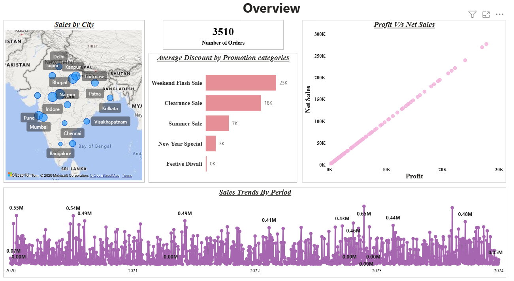
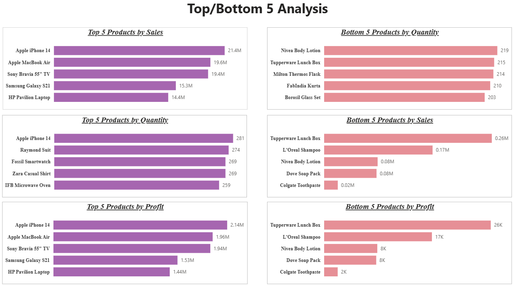
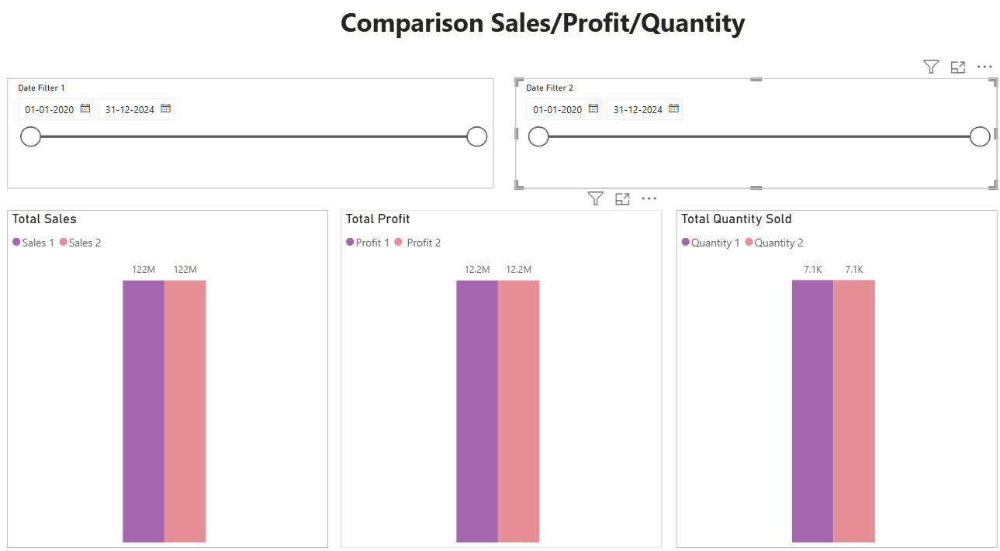
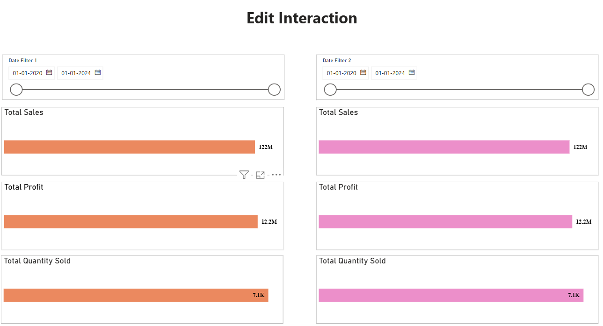
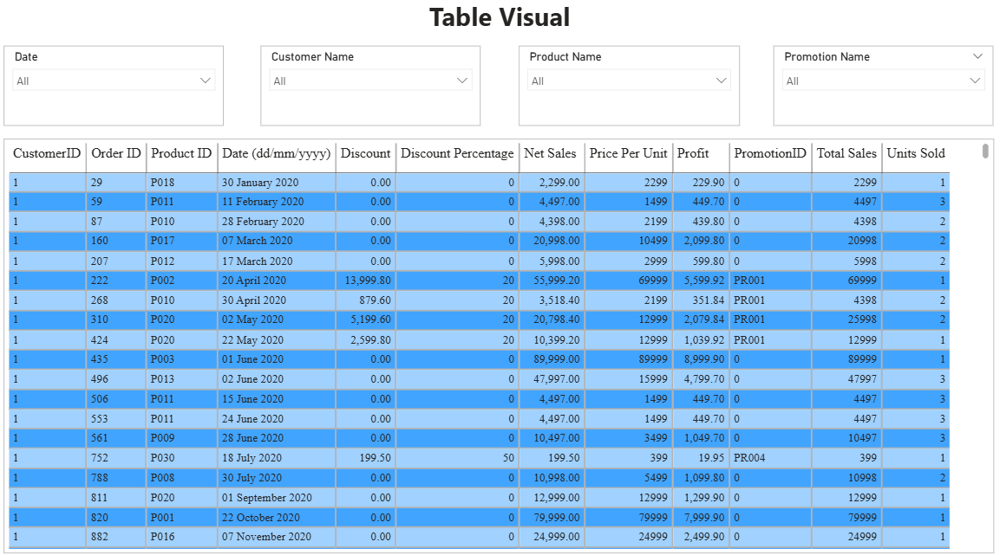

# Sales Performance Dashboard

## Problem Statement

This dashboard helps businesses understand their sales performance, product profitability, and customer purchasing patterns. It enables the organization to identify top-performing products, analyze sales trends over time, and evaluate the relationship between sales and profit.

Through this dashboard, businesses can identify high-performing and low-performing products, understand the impact of discounts, and analyze sales distribution across different cities. These insights help decision-makers improve sales strategies and optimize product performance.

## Tools & Technologies Used

- Power BI Desktop
- Power Query (Data Transformation)
- DAX (Data Analysis Expressions)
- Data Modeling (Star Schema)
- GitHub

## Steps Followed

**Step 1 : Load the dataset into Microsoft Power BI Desktop.
The dataset used in this project is a CSV file.

**Step 2 : Open Power Query Editor and enable: 
- Column Distribution
- Column Quality
- Column Profile

**Step 3 : Change the profiling option to "Column profiling based on entire dataset" instead of the default 1000 rows.

**Step 4 : Data cleaning and transformations were performed in Power Query, such as checking null values, correcting data types, removing unnecessary columns, and preparing the data for analysis.

**Step 5 : Create data model relationships between tables using Primary Keys and Foreign Keys.

**Step 6: Designed a Star Schema data model including:
- Fact Table → Sales,
- Dimension Tables → Product, Customer, Date, Promotion, and City

**Step 7 : Create measures using DAX for key metrics such as:
Total Sales

- Total Sales = SUM(Sales[Sales])

- Total Profit = SUM(Sales[Profit])

- Total Quantity = SUM(Sales[Units Sold])

**Step 8 : Add Card visuals to display important KPIs:
- Total Sales
- Total Profit
- Total Orders
- Average Discount

**Step 9 : Create Top and Bottom 5 Product Analysis using bar charts to identify:
- Top 5 Products by Sales
- Bottom 5 Products by Sales
- Top 5 Products by Profit
- Bottom 5 Products by Profit
- Top 5 Products by Quantity Sold
- Bottom 5 Products by Quantity Sold

**Step 10 : Create a Line Chart to analyze Sales Trends Over Time including:
- Daily trends
- Monthly trends
- Quarterly trends
- Yearly trends

**Step 11 : Add a Scatter Plot to visualize the relationship between Sales and Profit.

**Step 12 : Create a comparison dashboard to compare:
Sales, Profit, Quantity Sold, between two user-selected time periods.

**Step 13 : Create a visualization showing average discount offered across promotion categories.

**Step 14 : Add a Map Visualization to display sales by different cities.

**Step 15 : Create a detailed table visual displaying
- Order ID 
- Product
- Customer ID
- Sales
- Profit
- Discount
- Net Sales
- Quantity Sold

**Step 16 : Add interactive filters (Slicers) for: 
- Product
- Date
- Customer ID
- Promotion Category

**Step 17 : Configure Edit Interactions to control how visuals interact with each other.

**Step 18 : Publish the report to Power BI Service.

## Dataset

The dataset used for this project is available in this repository.

File:
- sales_dataset.csv

It contains information about:
- Orders
- Products
- Sales
- Profit
- Discounts
- Cities

## Power BI Project File

The complete Power BI dashboard file is available in this repository.

File:
- Sales_Analysis_Dashboard.pbix

You can download and open it using Microsoft Power BI Desktop to explore the interactive dashboard.

## Dashboard Overview

## Top & Bottom 5 Product Analysis

## Sales / Profit / Quantity Comparison

## Visual Interaction

## Order Details Table

## Insights

A Power BI dashboard was developed to analyze sales performance. The following insights were derived from the report.

1. Product Performance

The dashboard identifies Top 5 and Bottom 5 products based on:
- Sales
- Profit
- Quantity Sold

This helps businesses focus on high-performing products and improve low-performing ones.

2. Sales Trends

Sales trends were analyzed over time including:
- Daily trends
- Monthly trends
- Quarterly trends
- Yearly trends

This helps identify seasonal patterns and business growth trends.

3. Sales vs Profit Relationship

A scatter plot visualization shows the relationship between sales and profit, helping businesses understand product profitability.

4. Period Comparison

The dashboard allows comparison of:
- Sales
- Profit
- Quantity Sold

between two different time periods selected by the user.

5. Discount Analysis

The dashboard calculates the average discount offered across different promotion categories, helping evaluate the impact of promotions on sales.

6. City-wise Sales Analysis

A map visualization shows sales distribution across different cities, helping identify regions with higher sales performance.

7. Order-Level Analysis

A detailed table provides order-level insights, showing:
- Sales
- Profit
- Discount
- Net Sales
- Product
- Customer ID

with interactive filters for deeper analysis.

